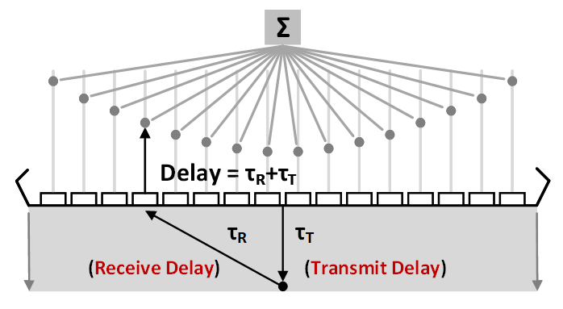
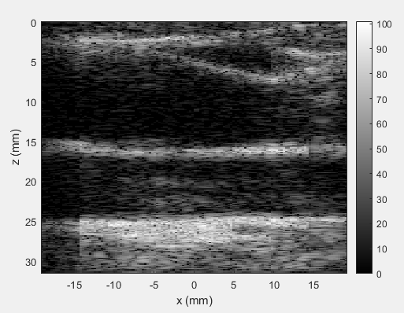

# Coherent Plane-Wave Compounding using Delay-and-Sum Beamforming for Ultrasound B-mode Imaging on PYNQ


<!-- TABLE OF CONTENTS -->
## Table of Contents

* [About the Project](#about-the-project)
* [Usage](#usage)
* [Algorithm](#algorithm)
* [References](#references)
* [Contributing](#contributing)
* [Contact](#contact)


<!-- ABOUT THE PROJECT -->
## About The Project
This project is about "Delay-and-Sum Beamforming for Ultrasound B-mode Imaging on PYNQ"

## Directory structure
* **README.md** - introduce the project, algorithm, reference ....
* **code/**
  * original - original code with no optimization (written by ourselves)
  * ipy - python code for Jupyter notebook
* **code-opt/** -
  * 01_fixedpointConversion_hls
  * 02_interface_hls
  * 03_IIRsingle_hls
  * 04_smallimage_hls
  * 05_changeorder_hls
  * 06_optTiming_hls
* **testdata/** 
  * echo_int16.txt: You can access from here 
  https://drive.google.com/file/d/11OW7qTOFMgjpr0hIPrDZ_mG-lpVT-axC/view?usp=sharing
* **impl/** 
  * HLS csynth report & 


<!-- USAGE EXAMPLES -->
## Usage
* **build process** - 
  run python code (host program) in code/ipy
  ```sh
  python DASstream.py
  ```

<!-- Algorithm -->
## Algorithm
* Coherent Plane-Wave Compouding: The output B-mode image is the summation of beamforming results from different firing angles
* Ultrasound Delay-and-Sum Beamforming: Sum the echoes which backscatter from the same position
* Delay = Transmit delay + Receive delay
  * Transmit delay: The delays of wave transmission from the transducer elements to scan pixels
  * Receive delay: The delays of backscatter signal from scan pixels to transducer elements
  


* Result


<!-- References -->
## References
* [1] G. Montaldo, M. Tanter, J. Bercoff, N. Benech, and M. Fink, “Coherent plane-wave compounding for very high frame rate ultrasonography and transient elastography,” IEEE Trans. Ultrason. Ferroelectr. Freq. Control, vol. 56, no. 3, pp. 489–506, Mar. 2009.
* [2] Z. Alomari, S. Harput, S. Hyder, and S. Freear, “The effect of the transducer parameters on spatial resolution in plane-wave imaging,” in Proc. IEEE Int. Ultrason. Symp., Oct. 2015, pp. 1–4.
* [3] M. Yang et al., “High volume rate, high resolution 3D plane wave imaging,” in Proc. IEEE Int. Ultrason. Symp., Sep. 2014, pp. 1253–1256.
* [4] N. Q. Nguyen and R. W. Prager, “A spatial coherence approach to minimum variance beamforming for plane-wave compounding,” IEEE Trans. Ultrason. Ferroelectr. Freq. Control, vol. 65, no. 4, pp. 522–534, Apr. 2018.

<!-- CONTACT -->
## Contact

Kevin: f06943176@ntu.edu.tw

