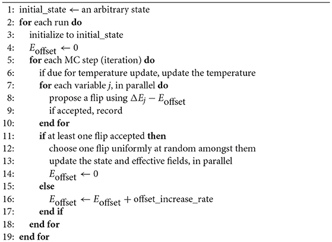

# MSOC Final Project - Digital Annealer

<!-- TABLE OF CONTENTS -->
## Table of Contents

* [About the Project](#about-the-project)
* [Usage](#usage)
* [Algorithm](#algorithm)
* [References](#references)
* [Contributing](#contributing)
* [Contact](#contact)


<!-- ABOUT THE PROJECT -->
## About The Project
This is a  github repository for hls final project. This project implement a digital annealer for solving a Travel salesman problem (TSP).

**Directory structure**
* **README.md** - introduce the project, algorithm, reference ....
* **code/**
  * original - original code we establish 
  * final (use inline pragma) - include both host and kernel code
* **code-opt/** - test with different pragma
  * code-Oo1
  * code-Oo2
* **testdata/** - include input test data
* **script/** 
  * run_hls.tcl  
* **impl/** - result of the implementation and report
      

<!-- USAGE EXAMPLES -->
## Usage
* **HLS**
  * According to the citysize, iterationNum, replicaNum, and cooling rate, edit the da.h 
  * Edit the files in run_hls.tcl
  * Open the Vivado HLS Command Prompt
  ```sh
  vivado_hls -f run_hls.tcl
  vivado_hls -p da_final
  ```

<!-- Algorithm -->
## Algorithm

<!-- References -->
## References
[An Accelerator Architecture for Combinatorial Optimization Problems](https://pdfs.semanticscholar.org/fd79/4c47edf63576c08dee95e901017c2b6d8f49.pdf)

<!-- CONTRIBUTING -->
## Contributing
- Digital annealer code implement with C++
- HLS implement
<!-- CONTACT -->
## Contact
- Ting-Yi Wu       r08943099@ntu.edu.tw
- Cheng-Han Hsieh  r08943154@ntu.edu.tw 


