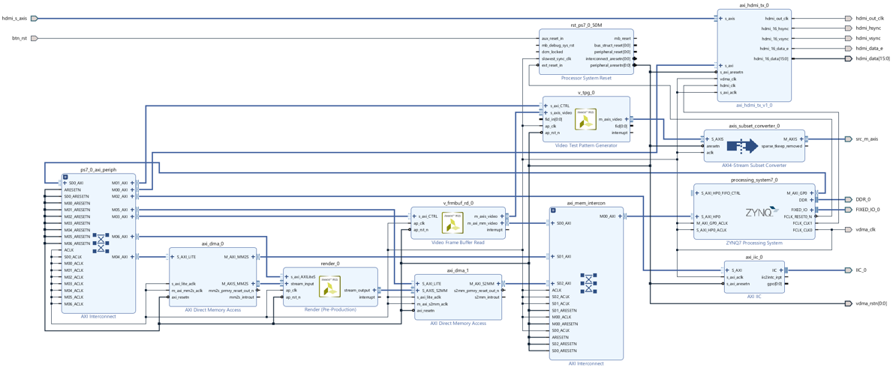

# HLS3D

## Table of Content
- [HLS3D](#hls3d)
  - [Table of Content](#table-of-content)
  - [About The Project](#about-the-project)
  - [Usage](#usage)
  - [References](#references)

## About The Project
Render a 3D scene with 640x480 resolution in real-time

**Directory structure**
* **fpga/**
  * FPGA control script
* **hls/**
  * HLS C++ source code (all original)
* **render/**
  * Software rendering (all original)

## Usage
* **Block Diagram**
  
* **Running on ZedBoard**
  * `sudo python3 ./fpga/run.py`

## References
* https://www.xilinx.com/support/documentation/sw_manuals/xilinx2020_1/ug902-vivado-high-level-synthesis.pdf
* https://www.scratchapixel.com/lessons/3d-basic-rendering/rasterization-practical-implementation
* https://learnopengl.com/Advanced-Lighting/Shadows/Shadow-Mapping
* http://www.opengl-tutorial.org/intermediate-tutorials/tutorial-16-shadow-mapping/
* https://cg2010studio.com/2011/08/19/shadow-mapping-%E5%8E%9F%E7%90%86/
* https://stackoverflow.com/questions/3380628/fast-arc-cos-algorithm
* https://developer.download.nvidia.com/cg/index_stdlib.html
